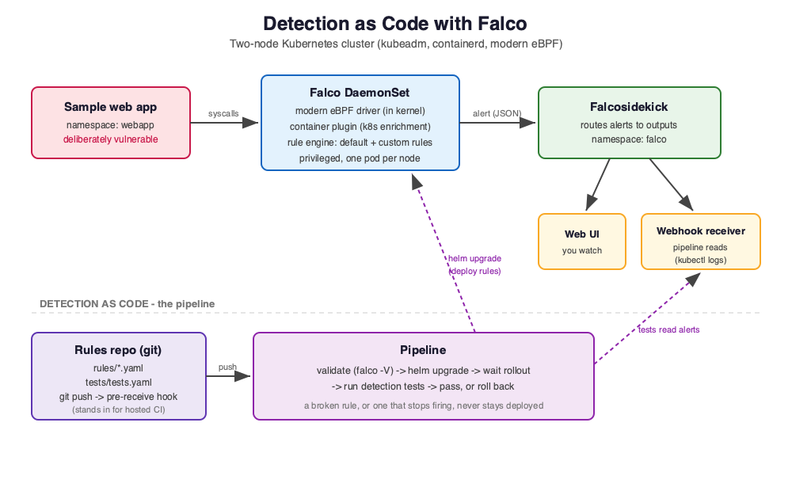

# Detection as Code: Testing and Deploying Falco Rules in Kubernetes

Image scanning and admission policies catch _known_ problems before a workload
starts. They cannot see what a container actually does once it is running — for
example when an attacker exploits an unknown vulnerability. **Runtime security**
closes that gap, and it is a core part of DevSecOps.

This lab treats runtime detection the way DevOps treats everything else: as code.
You will attack a running app, detect it with [Falco](https://falco.org), and then
manage the detection rules through a pipeline that **validates, deploys, tests and
rolls them back** — so a broken rule, or one that silently stops firing, is caught
before anyone relies on it.

## What you will learn

By the end you will be able to:

1. Explain the gap that build-time checks leave, and where Falco fits.
2. Trace a detection event from a syscall, through Falco's kernel driver and rule
   engine, to Falcosidekick and its outputs.
3. Write a custom Falco rule **and a test for it**, and ship both through a
   pipeline that validates, deploys and verifies them.
4. Recognise and recover from two failures the pipeline catches: a rule that is
   broken, and a rule that no longer fires.
5. Tune a false positive with a rule exception — through the same pipeline.
6. Close the loop: use an alert to find and fix the application bug, then confirm
   the attack now fails and raises no alert.

## The setup

A background script is installing Falco, Falcosidekick, its web UI and a webhook
receiver (all pinned versions) on a two-node Kubernetes cluster, deploying a small
**deliberately vulnerable** app, and creating a local Git repository for the
detection rules whose `git push` runs the pipeline. Wait for it to finish — the
terminal shows the progress — then start with Step 1.

> This is an authorised, self-contained teaching environment. Everything stays
> inside the cluster, and the final step has you fix the vulnerability yourself.
